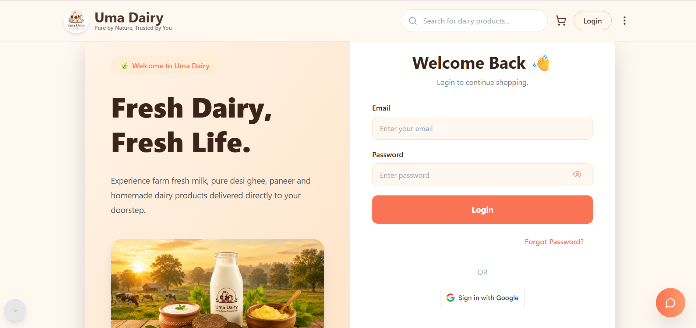
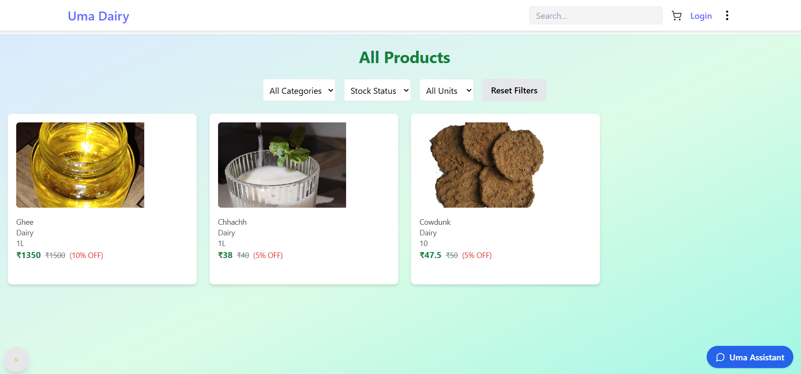
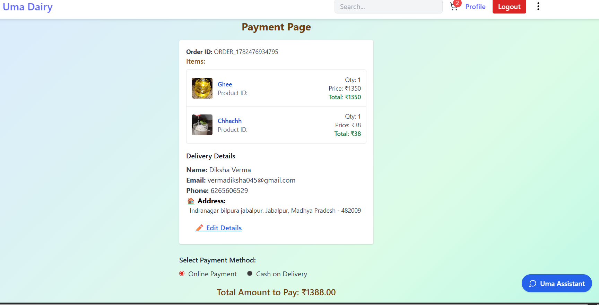
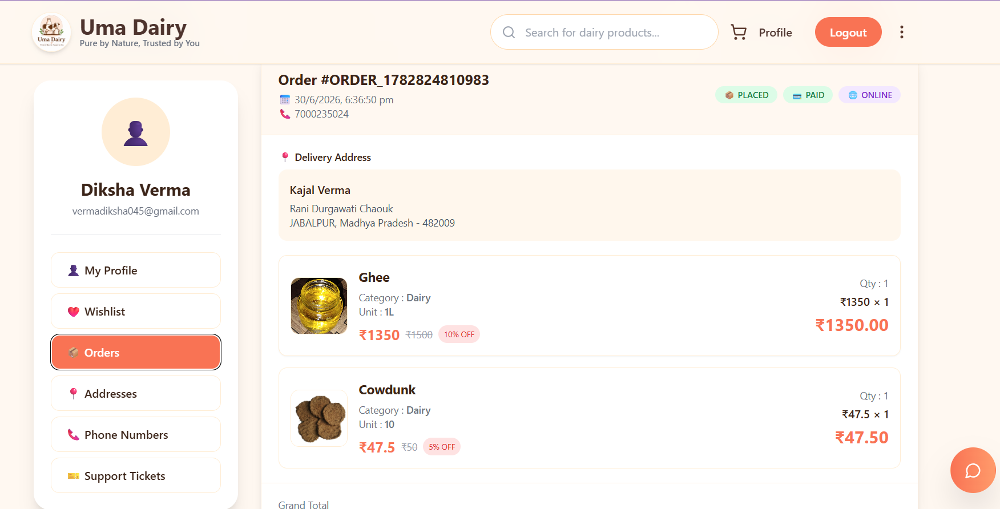

# 🥛 Uma Dairy

> A full-stack MERN e-commerce platform built to digitize a real local dairy business.

Uma Dairy is an e-commerce platform inspired by my mother's small dairy business. The goal of this project is to make trusted dairy products accessible online while learning how to build a complete production-ready web application.

---

# 🚀 Live Demo

**Frontend:** https://dairyfrontend.onrender.com

**Backend API:** https://uma-dairy.onrender.com

---

# 💡 Why I Built This

My mother runs a local dairy business where customers genuinely appreciate the quality of products like milk, ghee, paneer, and buttermilk.

While observing the business, I realized that although people trusted the products, the business had no online presence.

This inspired me to build Uma Dairy—not just as a college project, but as a real solution to help a small business reach more customers through technology.

---

# ✨ Features

- User Registration & Login (JWT Authentication)
- Browse Dairy Products
- Product Search
- Shopping Cart
- Address Management
- Order Placement
- Cash on Delivery (COD)
- Cashfree Payment Gateway Integration
- AI-powered Uma Assistant
- Customer Support Ticket System
- Order History
- Admin Product Management
- Protected Routes
- Responsive UI

---

# 🛠 Tech Stack

## Frontend

- React.js
- React Router
- Tailwind CSS
- Axios

## Backend

- Node.js
- Express.js
- MongoDB
- Mongoose
- JWT Authentication
- Cashfree Payment Gateway

## Deployment

- Render
- Docker

---

# 📂 Project Structure

```
Uma-Dairy
│
├── frontend
│
├── backend
│
├── docker-compose.yml
│
└── README.md
```

---

# 🔄 User Flow

```
Browse Products
      ↓
Add to Cart
      ↓
Login
      ↓
Address
      ↓
Checkout
      ↓
Cashfree / COD
      ↓
Order Success
      ↓
My Orders
```

---

# 🤖 Uma Assistant

Uma Dairy includes an AI-powered support assistant.

Users can simply type queries like:

- "I have an issue with my order"
- "Order not delivered"
- "Payment problem"

The assistant automatically creates a support ticket for customer assistance.

---

# 💳 Payment

Currently two payment options are available:

- Cash on Delivery (Recommended for Demo)
- Cashfree Payment Gateway

> **Note**
>
> The production online payment gateway is currently pending because the Cashfree merchant account is under verification.
>
> Please use **Cash on Delivery (COD)** while testing the project.

---

# 🧩 Biggest Technical Challenge

One of the biggest challenges while building Uma Dairy was integrating the Cashfree payment gateway.

The application flow was working correctly until webhook verification started failing due to a webhook signature mismatch.

Instead of relying only on tutorials, I studied the official Cashfree documentation, added backend logs, debugged the webhook verification process, and learned how production payment systems work.

This experience significantly improved my debugging and backend development skills.

---

# 📸 Screenshots

- Home

-Login

- Products

- Product Details

- Cart

- Checkout

- Orders

-My orders

- Admin Dashboard


---

# 🚀 Future Improvements

- Enable Production Cashfree Payments
- Product Reviews
- Inventory Analytics
- Email Notifications
- Mobile App

---

# 👩‍💻 Author

**Kajal Verma**

B.Tech Computer Science & Engineering

National Institute of Advanced Manufacturing Technology (NIAMT)

GitHub:
https://github.com/kajal19803

LinkedIn:
https://www.linkedin.com/in/kajal-verma-09a344241

---