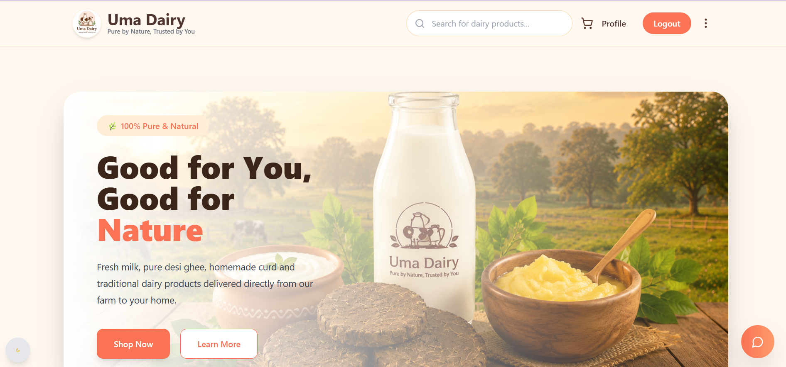
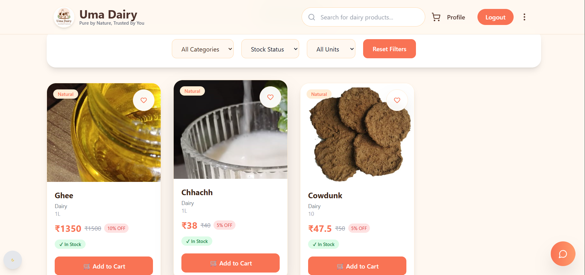
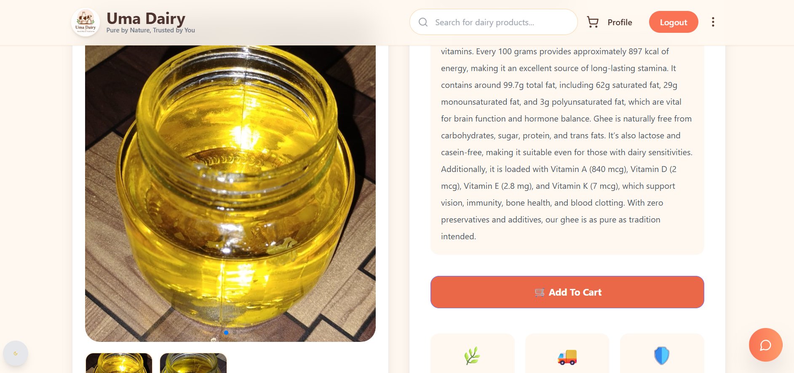
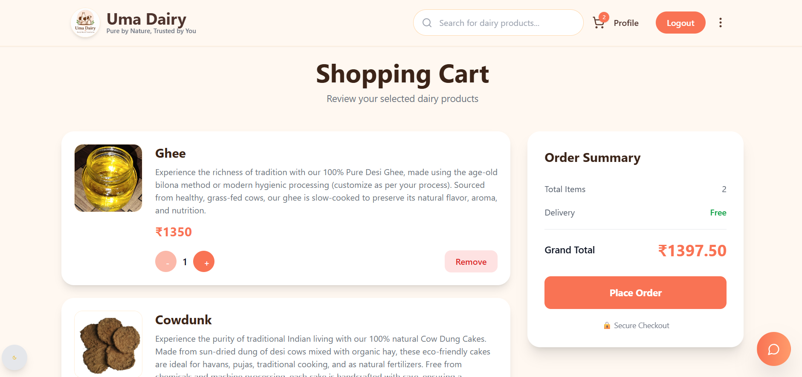
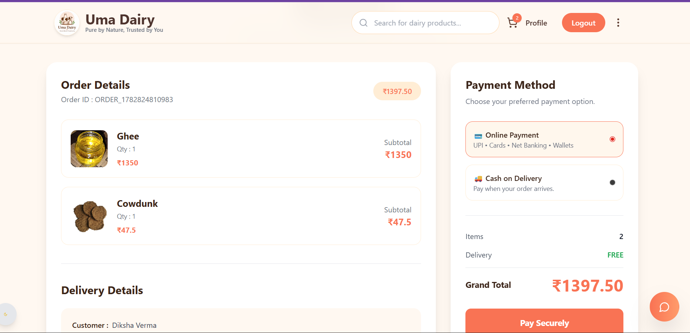
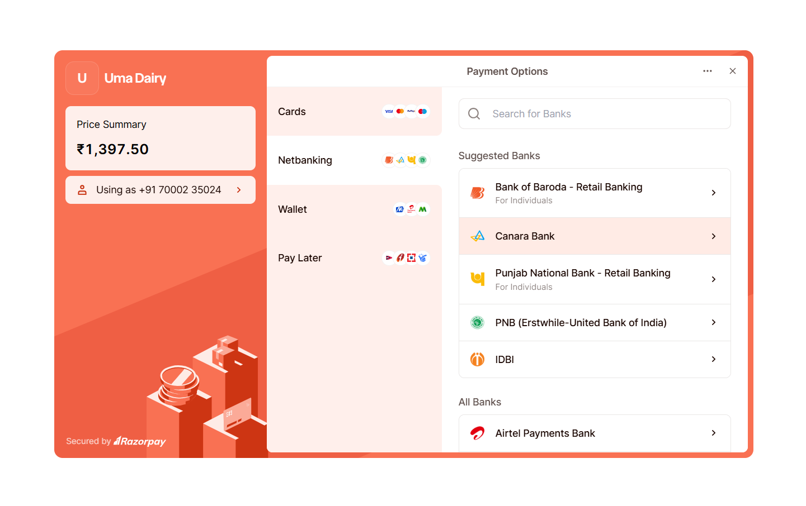
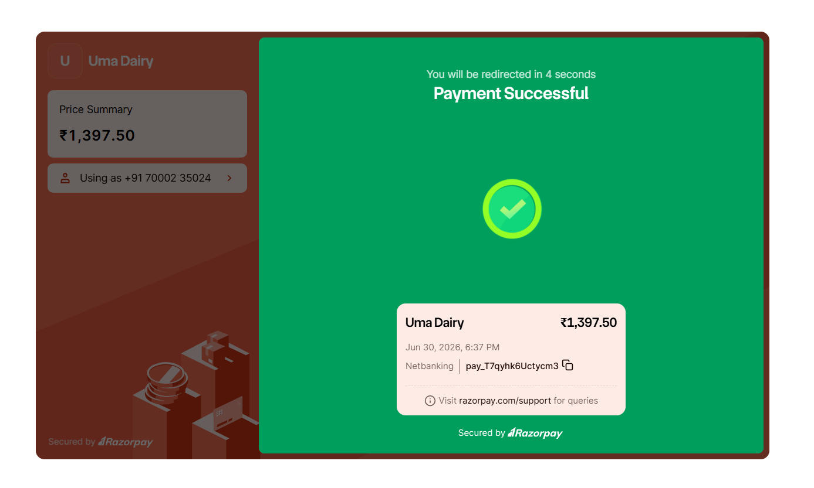
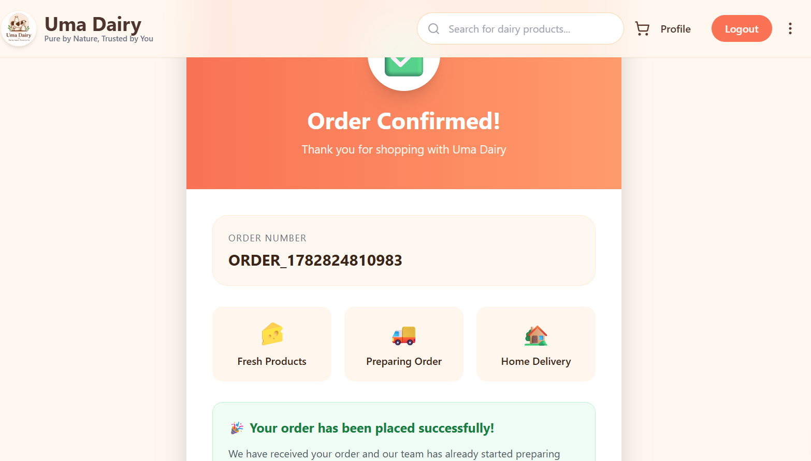
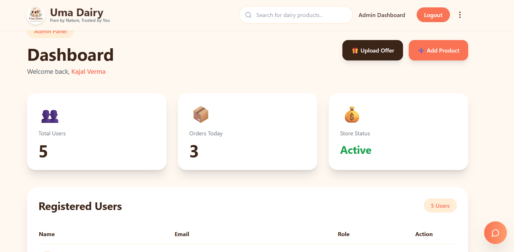

# 🥛 Uma Dairy

https://github.com/user-attachments/assets/9b437ae1-f951-4de9-96fd-7ce5c331cb9d

> A production-ready MERN Stack e-commerce platform built to digitize a real local dairy business.


📹 **If the embedded video doesn't load, you can watch it here:**  
[▶️ Watch Demo](demo/uma-dairy-demo.mp4)

---

# 🚀 Live Demo

🌐 **Frontend**  
https://dairyfrontend.onrender.com

⚙️ **Backend API**  
https://uma-dairy.onrender.com

---

# 💡 Why I Built This

Uma Dairy is inspired by my mother's local dairy business.

Although customers trusted the quality of products like ghee, paneer, milk, and buttermilk, the business had no online presence.

Instead of building another generic e-commerce website, I wanted to solve a real-world problem by digitizing a small business and helping it reach more customers through technology.

This project gave me hands-on experience with authentication, payments, order management, shipping integration, customer support, and building production-ready full-stack applications.

---

# ✨ Features

## 👤 Customer Features

- 🔐 JWT Authentication
- 🔑 Google OAuth Login
- 📧 Email OTP Verification
- 🔄 Forgot & Reset Password
- 👤 User Profile Management
- 🛍 Browse Products
- 🔍 Product Search
- 📄 Product Details
- 🛒 Persistent Shopping Cart
- 📍 Address Management
- 🎟 Apply Coupons
- 🎁 Offers & Discounts
- 💳 Razorpay Online Payments
- 💵 Cash on Delivery (COD)
- 📦 Order History
- 🚚 Real-time Delivery Status Tracking
- ⭐ Product Reviews & Ratings
- 📩 Automatic Review Request Email
- 🤖 AI-powered Customer Support Assistant
- 🎫 Automatic Support Ticket Generation
- 📱 Fully Responsive UI

---

## 🛠 Admin Features

- 📊 Admin Dashboard
- 📦 Product Management (CRUD)
- 📋 Order Management
- 🚚 Delivery Status Management
- 🎟 Coupon Management
- 🎁 Offer Management
- 👥 User Management
- ⭐ Review Management
- 🎫 Support Ticket Management
- 🔒 Protected Admin Routes

---

## ⚙ Backend Features

- RESTful API Architecture
- JWT Authentication & Authorization
- Role-based Access Control
- Google OAuth Authentication
- Email OTP Verification
- Password Hashing using bcrypt
- MongoDB with Mongoose
- Razorpay Payment Integration
- Razorpay Webhook Verification
- Secure HMAC Signature Validation
- Shiprocket API Integration
- AI Chat Support API
- Review Management API
- Coupon Management API
- Offer Management API
- Cart Management API
- Order Management API
- Delivery Management API
- Ticket Management API
- Global Error Handling
- Environment-based Configuration

---

## 🔒 Security

- JWT-based Authentication
- Password Encryption (bcrypt)
- Role-based Authorization
- Protected Admin Routes
- Razorpay HMAC Signature Verification
- Secure Environment Variables
- CORS Configuration
- Input Validation

---

## 🚀 Production Ready Features

- ✅ Responsive Design
- ✅ Docker Support
- ✅ Render Deployment
- ✅ MongoDB Atlas
- ✅ Razorpay Integration
- ✅ Shiprocket Integration
- ✅ Google OAuth Login
- ✅ Email OTP Verification
- ✅ AI Customer Support Assistant
- ✅ Automatic Ticket Generation
- ✅ Coupon & Offer Engine
- ✅ Persistent Shopping Cart
- ✅ Product Review System
- ✅ Review Email Notifications
- ✅ Secure REST APIs
- ✅ Production-grade Authentication

---

# 🛠 Tech Stack

## Frontend

- React.js
- React Router
- Tailwind CSS
- Axios

## Backend

- Node.js
- Express.js
- MongoDB
- Mongoose
- JWT Authentication
- Razorpay Payment Gateway
- Shiprocket API

## Deployment

- Render
- Docker

---

# 📂 Project Structure

```text
Uma-Dairy
│
├── frontend
├── backend
├── demo
├── screenshots
├── docker-compose.yml
└── README.md
```

---

# 🔄 Application Flow

```text
Browse Products
        │
        ▼
Add to Cart
        │
        ▼
Login / Register
        │
        ▼
Checkout
        │
        ▼
Choose Payment

     ┌───────────────┐
     │               │
     ▼               ▼

 Razorpay         Cash on Delivery

     │               │
     └───────┬───────┘
             ▼

     Payment Verification
             │
             ▼

     Order Confirmation
             │
             ▼

     Shiprocket Order
             │
             ▼

         My Orders
```

---

# 🤖 AI Support Assistant

Uma Dairy includes an AI-powered customer support assistant.

Users can simply type queries such as:

- "My payment failed."
- "Order not delivered."
- "I have an issue with my order."

The assistant automatically creates support tickets, making customer support faster and more convenient.

---

# 💳 Payments

The platform currently supports:

- 💳 Razorpay Online Payments
- 🚚 Cash on Delivery (COD)

The Razorpay integration includes:

- Secure Order Creation
- HMAC Signature Verification
- Payment Verification
- Order Status Synchronization

---

# 🚚 Shipping

After successful payment (or COD confirmation), the order is automatically sent to **Shiprocket** for shipment creation.

> **Note**
>
> Shiprocket integration has been implemented successfully.
> Shipment creation requires an active Shiprocket seller account.

---

# 🧩 Biggest Technical Challenge

The most challenging part of this project was implementing a secure payment workflow.

Initially, I integrated the Cashfree Payment Gateway but faced webhook signature mismatch issues while verifying payment callbacks.

To gain a better understanding of production payment systems, I migrated the application to Razorpay and implemented:

- Razorpay Order Creation
- Secure HMAC Signature Verification
- Payment Verification API
- Order Status Synchronization
- End-to-End Payment Flow

This experience significantly improved my backend debugging skills and my understanding of production-grade payment systems.

---

# 📸 Screenshots

## 🏠 Home



---

## 🔐 Login


---

## 🛍 Products



---

## 📄 Product Details



---

## 🛒 Shopping Cart



---

## 📦 Checkout



---

## 💳 Razorpay Payment



---

## ✅ Payment Successful



---

## 🎉 Order Confirmation



---

## 📜 My Orders


---

## ⚙️ Admin Dashboard



---

# 🚀 Future Improvements

- ⭐ Product Reviews & Ratings
- ❤️ Wishlist
- 📧 Email Notifications
- 📊 Inventory Analytics
- 📈 Sales Dashboard
- 📱 Mobile Application
- 📍 Live Order Tracking

---

# 👩‍💻 Author

**Kajal Verma**

B.Tech Computer Engineering  
National Institute of Advanced Manufacturing Technology (NIAMT), Ranchi

### GitHub

https://github.com/kajal19803

### LinkedIn

https://www.linkedin.com/in/kajal-verma-09a344241

---

⭐ If you found this project interesting, feel free to give it a **Star**!